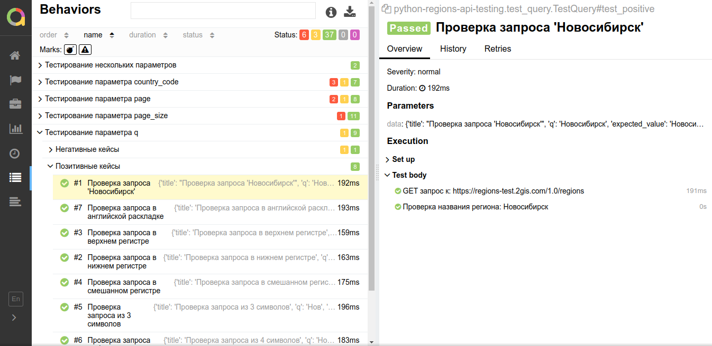

# python-regions-api-testing

Автоматизация тестирования API для <https://regions-test.2gis.com/1.0/regions>

##### Запуск тестов при помощи docker-compose

В директории проекта выполнить команду:
`docker-compose up`
Отчет о тестировании доступен по адресу: 
<http://localhost:5050/allure-docker-service/projects/default/reports/latest/index.html>

##### Запуск тестов при помощи pytest

Установка зависимостей:
`pip install -r requirements.txt`
Запуск тестов:
`pytest python-regions-api-testing/  --alluredir python-regions-api-testing/report`